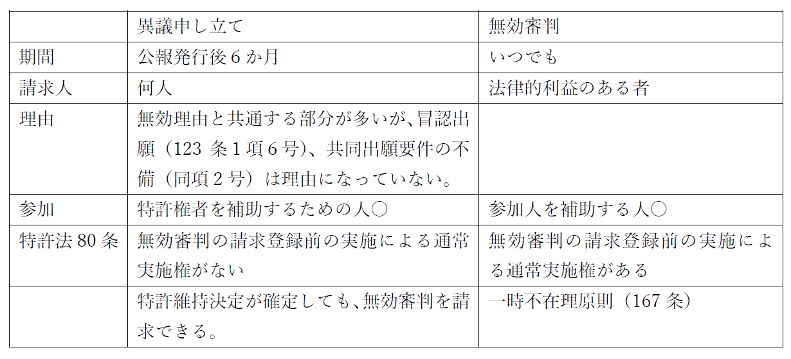

# 特許異議申し立て

・113条（特許異議申し立て）：何人も、特許掲載公報の発行の日から六月以内に限り、特許庁長官に、特許が次の各号のいずれかに該当することを理由として特許異議の申立てをすることができる。

→審理は3～5名の審判官の合議体（114条1項）で全件書面審理（118条１項）。

・審判手続きに関する規定の準用（120条の8）

異議手続きと無効審判の相違点



・異議理由（113条）があるか否かを、審判官が審理して（120条の2）、取り消し決定（114条2項）か、特許維持決定（同行4号）をする。
・取り消し決定をしようとする時は、意見書と訂正請求をする機会を与えないといけない（120条の5）

